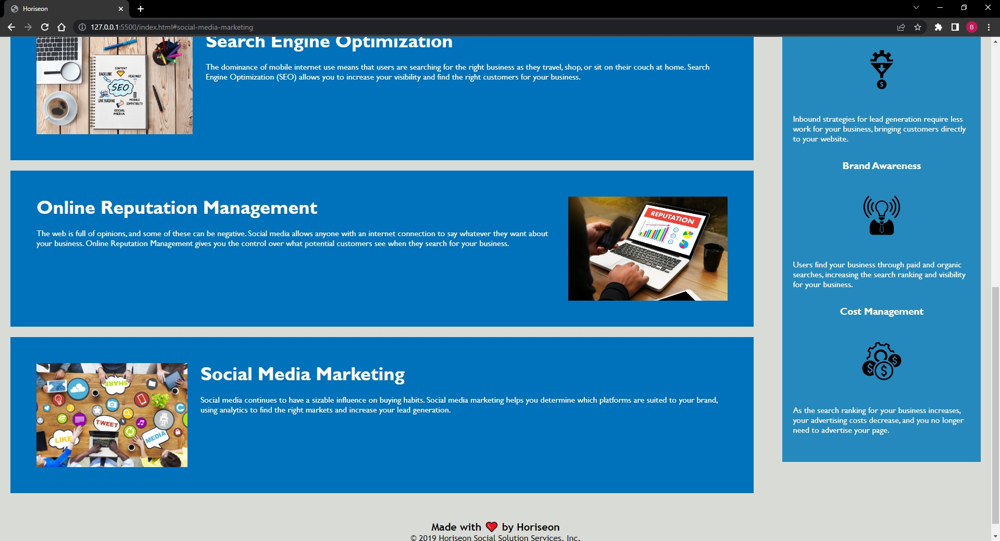

# Challenge Week 1

## Overveiw
This code has been updated to be more accessible by adding atl attributes of the images. I also added semantic HTML elements that weren't previously in the code.
The style.css file was also rearranged and updated. Comments have been added to css file. CSS file was cleaned up by taking multiple elements that had the same
description and put into just one class element to make file cleaner.

## Link to Live Webpage
https://frutaseca.github.io/Challenge-Week1/ 

## Picture of Webpage

